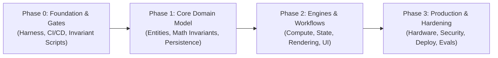

# Master Skill: System Architecture & Technical Planning

This skill codifies production architecture and roadmapping best practices derived from `claude-full-stack-2.0`, `vibe-coding-guide`, and Tier-1 engineering methodologies.

---

## 1. The Phased Architecture Life-Cycle

Never start coding features until the verification foundation is operational. Every production project must follow this 4-phase progression:



### Phase 0: Verification Infrastructure First
- Before writing domain code, establish:
  1. Test runner (`vitest`, `pytest`, `cargo test`).
  2. Pre-commit invariant checks (linting, typechecking, AST guards).
  3. Continuous Integration workflow running on every push/PR.
  4. Safe-by-default runtime boundary (`live` throws on stubs, `demo` allows mocks for tests).

---

## 2. Roadmap Decomposition & Falsifiable Acceptance Criteria

A roadmap without falsifiable criteria is just wishful thinking. In `docs/ROADMAP.md`:

1. **Atomic Tasks**: Break epics into tasks that take 1-3 engineering hours each.
2. **Explicit Dependencies**: A task cannot be started until its listed dependencies have status `done`.
3. **Acceptance Criteria Standard**:
   - ❌ Bad: "Make timeline editing fast and responsive."
   - ✅ Good: "Scrubbing 100 clips over a 10-minute timeline maintains 60 FPS (frame delta < 16.6ms); measured via performance benchmark test."
   - ❌ Bad: "Add speech recognition."
   - ✅ Good: "`whisper_onnx.rs` accepts 16kHz mono PCM buffer and returns array of `TokenTimestamp { word, startMs, endMs }` matching golden fixture."

---

## 3. The Single Source of Truth Law

- There must be exactly **ONE** live status tracker (`PROGRESS.md`).
- **Forbidden**: Maintaining multiple parallel checklists (e.g. README checklist vs. ROADMAP checklist). When multiple trackers exist, they will inevitably diverge and create false-completion illusions.
- Status Vocabulary:
  - `todo`: Dependencies met, ready for pickup.
  - `in_progress`: Claimed by an agent.
  - `blocked`: Cannot proceed; reason logged.
  - `done`: Code shipped, acceptance criteria demonstrably executed, tests passing.

---

## 4. Architecture Decision Records (ADRs) in `docs/DECISIONS.md`

Any choice that is expensive to reverse requires an ADR:

```markdown
## ADR-<n>: <Short Descriptive Title>
- **Date:** <YYYY-MM-DD>
- **Status:** proposed | accepted | superseded by ADR-<m>
- **Task:** <Roadmap Task ID>
- **Context:** <What technical problem or requirement forced a decision?>
- **Options Considered:** 
  - Option A: <Tradeoffs and reason for rejection>
  - Option B: <Tradeoffs and reason for rejection>
  - Option C: <Chosen option>
- **Decision:** <Exact choice and architectural boundary>
- **Consequences:** <What becomes easier, what becomes harder, what is locked in>
```

---

## 5. Audit & Gap Analysis (`docs/GAP_ANALYSIS.md`)

When inheriting or taking over an existing codebase:
1. Conduct an honest audit: compare what the documentation claims vs. what the code actually executes.
2. Record file and line number evidence for every stub, mock, or dead-code path.
3. Establish a baseline before proceeding with new feature claims.
