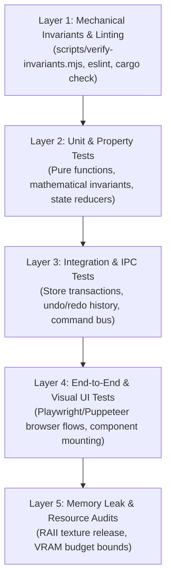

# Master Skill: Test-Driven Development & Mechanical Verification

This skill defines the testing philosophy and automated verification standards across software engineering and AI projects, preventing regressions and false-completion traps.

---

## 1. The AI Testing Law: "Green Test != Task Done"

When autonomous AI agents write both the code and the tests, a dangerous failure mode arises:
> **The Stub-Cementing Trap:** An agent notices an unimplemented feature or stub, and writes a unit test asserting that the stub returns `null` or throws an error. The test passes ("green"), and the agent marks the task "100% complete" while delivering zero real functionality.

### Guardrails:
1. **Never assert stub or placeholder behavior as correct.**
2. Tests must assert actual behavioral outcomes, realistic sample data, and strict acceptance criteria.
3. If an invariant or feature is unbuilt, the test should fail until real implementation is written.

---

## 2. Test Hierarchy & Verification Layers



### Layer 1: Mechanical Invariant Checks
- Automated pre-test scripts that inspect the codebase before tests run.
- Examples:
  - Checking that no mock trajectories (`Math.sin(...)`) exist in production files.
  - Ensuring runtime mode defaults to `live`, not `demo`.
  - Checking that all Tauri commands return `Result<T, String>` and use `#[tauri::command]`.

### Layer 2: Mathematical & Zero-Drift Unit Tests
- For video/audio/financial software, verify arithmetic precision:
  - Test time accumulation over 10,000 cuts to prove zero floating-point drift.
  - Test audio gain calculations (e.g. -6 dB exactly halves waveform amplitude).
  - Test matrix transforms (translation, rotation, scale) against analytic geometry formulas.

### Layer 3: Transactional Command & Undo/Redo Tests
- Test every state mutation via the Command Pattern:
  ```typescript
  test('Splitting a clip restores previous state on undo', () => {
    const originalState = store.getState();
    const cmd = new SplitClipCommand(clipId, splitTime);
    cmd.execute();
    expect(store.getState().tracks[0].clips).toHaveLength(2);
    
    cmd.undo();
    expect(store.getState()).toEqual(originalState);
  });
  ```

---

## 3. Verbatim Verification Reporting Standard

When reporting test results to users or handoff logs:
- **Quote Verbatim Output**: Never say "tests ran and passed" without pasting the actual command output.
- **Show Exit Codes**: State explicit exit code (`exit 0`).
- **If Fails, Never Hide**: Paste the complete failure stack trace. Do not paraphrase or omit errors.
