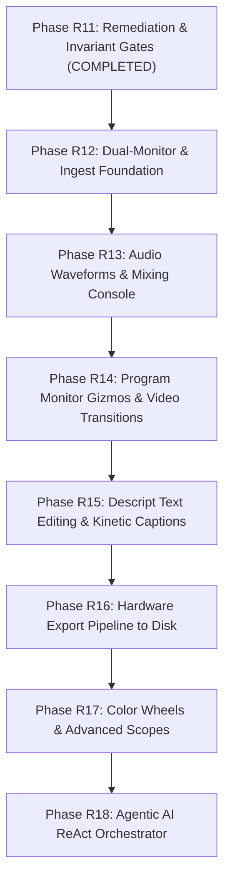

# Deep Research: Comprehensive NLE Comparative Analysis & CineCraft AI Gap Audit

> **Document Type:** Systems Engineering & Architectural Research  
> **Date:** September 20, 2026  
> **Subject:** Complete competitive analysis of Tier-1 Non-Linear Video Editors (DaVinci Resolve, Adobe Premiere Pro, Apple Final Cut Pro, CapCut Desktop, Descript) vs. **CineCraft AI**, cataloguing every missing architectural system, interaction paradigm, and engine capability.

---

## 1. Executive Summary

Modern non-linear video editors (NLEs) have evolved into high-throughput, real-time multimedia production suites. Historically, professional workflows were split: **Premiere Pro** led editorial cutting, **DaVinci Resolve** dominated color grading and Fairlight audio mastering, **Final Cut Pro** championed magnetic timeline speed, and **After Effects** handled compositing. 

Over the last 24 months, the industry has undergone a radical paradigm shift driven by:
1. **AI-Native Text-Based Editing & Speech Intelligence** (pioneered by *Descript* and integrated into Premiere): Cutting video by selecting, editing, or deleting words from an automatically transcribed speech track.
2. **Social-First Kinetic Typography & Viral Automation** (pioneered by *CapCut Desktop*): Word-by-word animated captions, 1-click active speaker auto-reframe for 9:16 vertical video, 1-click background cutout, and speech-to-song.
3. **Agentic Copilots & Multimodal Natural Language Editing**: Translating high-level human directives (*"Cut out all dead pauses longer than 0.5s, zoom in on the host when he introduces the product, and grade in a moody teal-and-orange style"*) into transactional, undoable timeline edit decision lists (EDLs).

### CineCraft AI: Current State vs. Industry Reality
Following the completion of **Phase R11** (Remediation & Invariant Enforcement), CineCraft AI possesses a clean, honest foundation:
- Zero fabricated mock data on the primary execution path.
- A strict rational time model (`RationalTime`) preventing floating-point frame drift.
- A command-pattern transactional undo/redo history.
- Real WebGPU shader pipelines for YUV-to-RGB conversion, tetrahedral 3D LUTs, Lift/Gamma/Gain color math, and basic blur/keying shaders.
- Native Tauri/Rust commands for media probing, raw video demuxing, Silero VAD, and Whisper ONNX.

**However, CineCraft AI is currently an architectural engine core with significant high-level feature gaps.** When compared to DaVinci Resolve, Premiere Pro, Final Cut Pro, CapCut, and Descript, **CineCraft AI is still missing critical workflows that video editors expect on day one.**

---

## 2. Comprehensive Comparative Matrix (The Big 5 vs. CineCraft AI)

| Capability / Architecture Pillar | DaVinci Resolve 19 Studio | Adobe Premiere Pro 2025 | Apple Final Cut Pro 11 | CapCut Desktop Pro | Descript | **CineCraft AI (Current)** |
| :--- | :--- | :--- | :--- | :--- | :--- | :--- |
| **1. Dual-Monitor Ingest (Source / Program)** | ✅ Full (Source/Record, 3-point edit, Gang sync) | ✅ Full (Source/Program, In/Out, Insert/Overwrite) | ⚠️ Single viewer default (Event viewer opt-in) | ❌ Single viewer only | ❌ Single viewer only | ❌ **Missing** (Program Monitor only; no Source viewer) |
| **2. Timeline Audio Waveform Rendering** | ✅ Multi-resolution RMS/Peak envelopes | ✅ Dynamic 16-bit cached waveform draw | ✅ Real-time audio waveform with auto-level | ✅ Visual waveform on audio tracks | ✅ Word-aligned audio waveform strip | ❌ **Missing** (Audio clips render as solid color blocks) |
| **3. On-Screen Transform Gizmos** | ✅ Bounding box, anchor pivot, corner pins, crop | ✅ Motion gizmo with bezier rotation/scale handles | ✅ Transform/Crop/Distort on-canvas overlays | ✅ 8-point bounding box with rotation puck | ❌ Text-box handles only | ❌ **Missing** (Only numeric inputs in Inspector) |
| **4. Video Transitions Engine** | ✅ GPU-accelerated Fusion transitions (100+) | ✅ GPU native transitions (Dissolves, Wipes, Motion) | ✅ Real-time CoreImage transition presets | ✅ Kinetic 3D transitions & viral zooms | ⚠️ Basic cross-dissolves | ❌ **Missing** (Only audio micro-crossfades exist) |
| **5. Text-Based Video Editing** | ⚠️ Basic transcript cut in Cut page | ✅ Full Text panel with two-way ripple edit | ❌ Caption generation only (no ripple text cut) | ⚠️ Auto-caption only | ✅ Primary workflow: script edits mutate video | ⚠️ **Partial** (Display only; no 2-way ripple sync) |
| **6. Kinetic / Animated Auto-Captions** | ⚠️ Static subtitle tracks only | ⚠️ Essential Graphics styling (keyframed) | ⚠️ Motion graphics titles | ✅ Auto word-bounce, glow, stroke, viral templates | ⚠️ Karaoke word highlight | ❌ **Stub** (Plain un-animated text overlay) |
| **7. Active Speaker Auto-Reframe (9:16)** | ✅ Neural Engine Smart Reframe | ✅ Auto Reframe (Face & motion tracking) | ✅ Smart Conform (Object/face saliency) | ✅ Auto-reframe with face lock | ❌ Manual crop only | ⚠️ **Partial** (Kalman math real; face input missing) |
| **8. Multi-Track Audio Mixing Console** | ✅ Fairlight (Console, 6-band EQ, Dyn, Buses) | ✅ Track Mixer & Clip Mixer (PDC, 32-bit float) | ⚠️ Role-based audio inspector | ⚠️ Basic clip volume sliders | ⚠️ Studio Sound 1-click enhancement | ⚠️ **Partial** (10-band EQ exists; no mixer console) |
| **9. Color Grading & Scopes** | ✅ Industry benchmark (Wheels, Curves, OCIO) | ✅ Lumetri Color & Lumetri Scopes | ✅ Color wheels, Color board, Curves | ⚠️ Filter presets & basic LUT import | ❌ Basic exposure/tint sliders | ⚠️ **Partial** (Scopes exist; UI is sliders, not wheels) |
| **10. Proxy Generation & Offline Relink** | ✅ Proxy Generator App + 1-click toggle | ✅ Media Encoder ingest proxies + relink | ✅ ProRes Proxy auto-generation | ❌ Always decodes native file | ❌ Cloud-only proxy caching | ❌ **Missing** (Proxy toggle & generator not wired) |
| **11. Hardware-Accelerated Export** | ✅ NVENC, QuickSync, VideoToolbox, AMD AMF | ✅ Hardware accelerated encoding pipeline | ✅ Apple Silicon Media Engine (ProRes/H.265) | ✅ GPU-accelerated social exports | ⚠️ Cloud render / local WebCodecs | ⚠️ **Partial** (Rust builder exists; no live render) |
| **12. Natural Language AI Copilot** | ⚠️ DaVinci Neural voice & text search | ⚠️ Firefly video prompts (Generative fill) | ❌ None built-in | ⚠️ AI script-to-video prompt | ⚠️ Underlord AI assistant | ⚠️ **Partial** (Console UI exists; orchestrator unbacked) |

---

## 3. Pillar-by-Pillar Deep Architectural Gap Analysis

### Pillar 1: Media Ingest, Codec Support & Dual-Monitor Workspace
#### Industry Standard (DaVinci Resolve / Adobe Premiere Pro)
1. **Source & Program Dual-Monitor System:**
   - **Source Monitor:** Dedicated viewport to scrub uncommitted camera raw footage, set Mark In (`I`) and Mark Out (`O`), scrub audio, and perform 3-point edits into the timeline using Insert (`,`) or Overwrite (`.`).
   - **Hover-Scrub in Bins:** Moving the mouse cursor horizontally across any thumbnail in the Asset Bin scrubs through the clip in real time without needing to open it.
2. **Proxy Ingest Pipeline:**
   - Background transcode worker generates 720p Apple ProRes 422 Proxy or DNxHR LB files.
   - Program Monitor has a dedicated "Toggle Proxies" button (`Alt+P`) that instantly switches rendering between proxy and full-resolution without moving edit points.
3. **Media Relinking & Offline Management:**
   - Moving or renaming files triggers an explicit "Media Offline" red slate.
   - Right-click -> "Relink Media" provides recursive folder search and UUID/SHA-256 matching.

#### What CineCraft AI Has Right Now
- Only a single `ProgramMonitor.tsx` viewport displaying the sequence timeline.
- `AssetBin.tsx` has list and grid views, but thumbnails are static icons; hover-scrubbing does not decode frames.
- No Source Monitor exists. Users must drag the entire clip to the timeline and cut it after placement.
- `nativeBridge.ts` has a stubbed `generateProxyMedia()` returning a string with no transcode execution.

---

### Pillar 2: Timeline Engine, Multi-Track Architecture & Advanced Trimming
#### Industry Standard (Final Cut Pro / Premiere Pro)
1. **Audio Waveform Visualization:**
   - Professional NLEs pre-compute peak and RMS amplitude envelopes (min/max pairs per audio block) during ingest into a binary `.cfa` or LevelDB cache.
   - The timeline canvas dynamically draws bezier-smoothed waveform peaks at 60fps across arbitrary horizontal zoom levels.
2. **Interactive Audio Rubberbands & Seam Handles:**
   - Every audio clip displays a horizontal volume line (0 dB). Clicking adds volume keyframes directly on the timeline.
   - Clip edges feature top-corner fade handles (dragging inward creates logarithmic audio fade-in/fade-out).
3. **Advanced Trimming Tools (Ripple, Roll, Slip, Slide):**
   - **Ripple Edit (B / Q / W):** Trimming a cut point automatically shifts all downstream clips to eliminate gaps.
   - **Roll Edit (N):** Moving a cut point simultaneously trims the outgoing clip tail and incoming clip head, keeping timeline duration constant.
   - **Slip (Y) & Slide (U):** Shifting the visible media window inside a clip without moving its position on the timeline (Slip), or moving the clip while adjusting its neighbours (Slide).
4. **Video Transitions Engine:**
   - Dragging a Cross Dissolve, Dip to Black, or Wipe across two adjacent clips places a visual transition block spanning the cut seam.
   - Dual-input fragment shader blends `Clip_A` texture and `Clip_B` texture across the normalized transition progress `t \in [0.0, 1.0]`.

#### What CineCraft AI Has Right Now
- `TimelineTrackEditor.tsx` renders clips on video and audio tracks, but audio clips are **solid color rectangles** with no waveform rendering.
- Editing operations (Split, Delete, Trim) exist in `src/core/commands/edits.ts`, but advanced Ripple Head (`Q`), Ripple Tail (`W`), Roll, Slip, and Slide interactions lack intuitive mouse handle indicators and keyboard bindings.
- Video transitions are completely absent; only 4ms audio micro-crossfades are applied to prevent speaker pops.

---

### Pillar 3: Viewport Interaction, On-Screen Transform Gizmos & Transport
#### Industry Standard (Premiere Pro / CapCut Desktop)
1. **Interactive On-Screen Transform Gizmo:**
   - Clicking any video clip in the Program Monitor immediately displays an interactive bounding box overlay with 8 anchor points (corners and edges), a rotation puck handle, and a center pivot.
   - Dragging handles resizes (scaling X/Y), dragging outside rotates, and dragging inside repositions.
2. **Safe Margin & Social Aspect Guides:**
   - Overlays displaying Action Safe (90%), Title Safe (80%), and social media overlays (TikTok comment/caption occlusions, Instagram UI cutouts).
3. **Playback Resolution Scaling:**
   - Real-time dropdown to drop playback raster to 1/2, 1/4, or 1/8 to guarantee smooth 60fps scrub on resource-constrained hardware.

#### What CineCraft AI Has Right Now
- `ProgramMonitor.tsx` renders the composited video frame via WebGPU canvas, but has **zero interactive canvas gizmos**.
- Clip repositioning, scaling, and rotation can only be done by selecting the clip and typing raw numbers into inputs.
- Aspect ratio selection (16:9, 9:16, 1:1, 4:5) changes the canvas CSS container, but lacks social overlay masks.

---

### Pillar 4: Text-Based Video Editing & Speech Intelligence
#### Industry Standard (Descript / Adobe Premiere Pro)
1. **Two-Way Text-to-Timeline Bidirectional Binding:**
   - Speech-to-text transcript is synchronized word-for-word with the audio timeline via forced alignment.
   - Highlighting a sentence in the transcript and pressing `Backspace` executes an atomic **Ripple Delete** on the timeline, cutting out the video and audio seamlessly.
   - Copy-pasting text across paragraphs cuts and moves the corresponding video clips on the timeline.
2. **One-Click Filler Word Removal:**
   - AI detects "um", "uh", "like", "you know", and repetitive stutter words.
   - Displays a sidebar listing all detected filler words with context snippets.
   - Clicking "Remove All" ripples out all filler words and automatically inserts micro-crossfades on audio seams.
3. **One-Click Silence Removal:**
   - Voice Activity Detection (VAD) identifies silent pauses longer than a customizable threshold (e.g. 0.4s).
   - Sliders allow adjusting silence duration and padding around cuts (e.g. 50ms pre/post pad to preserve natural cadence).

#### What CineCraft AI Has Right Now
- `silero_vad.rs` and `whisper_onnx.rs` exist on the native Rust backend.
- `TranscriptEditor.tsx` renders word bubbles and has a basic split/delete helper, but does not support full two-way transcript editing, copy-paste restructuring, or a dedicated 1-click batch filler-word removal modal.

---

### Pillar 5: Social Video Intelligence, Kinetic Captions & Auto-Reframe
#### Industry Standard (CapCut Desktop / Opus Clip)
1. **Kinetic Animated Captions:**
   - Auto-captions styled with modern viral presets:
     - Word-by-word karaoke pop/bounce.
     - Custom font faces, text stroke/outline, drop shadows, and glowing background badges.
     - Auto-insertion of relevant emojis based on sentiment and keyword triggers (e.g. 🔥, 💡, 🚀).
2. **Active Speaker Auto-Reframe (16:9 Landscape -> 9:16 Vertical):**
   - Computer vision model (YOLO face/pose or MediaPipe) detects the active speaker in real time.
   - Saliency bounding boxes are tracked, and a smoothed Kalman filter crops the 16:9 raster to 9:16, keeping the speaking subject framed.
3. **Zero-Shot Background Cutout (Portrait Segmentation):**
   - Neural network (e.g. MODNet or SAM 2) separates the foreground human subject from the background without a physical green screen.

#### What CineCraft AI Has Right Now
- `captionEngine.ts` and `caption.wgsl` compile a fragment shader, but only render a flat, static text box. There are no kinetic bounce animations, font outline styling, or emoji integrations.
- `autoReframe.ts` implements a real EMA/Kalman crop window smoothing filter, but **has no upstream face/person detection model feeding it coordinates**.
- `sam2Masking.ts` was historically stubbed with a 1x1 transparent PNG.

---

### Pillar 6: Color Science, 3-Way Wheels & Real-Time Scopes
#### Industry Standard (DaVinci Resolve / Premiere Lumetri)
1. **Interactive 3-Way Color Wheels:**
   - Dedicated UI with circular chromaticity pucks for **Lift** (shadows), **Gamma** (midtones), and **Gain** (highlights), surrounded by master brightness rings.
   - Real-time dragging of pucks modifies color temperature, tint, balance, and exposure.
2. **Curves & HSL Secondary Qualifiers:**
   - Master RGB Curves and Hue vs Hue / Hue vs Saturation curve editors.
   - Eyedropper tool to pick a specific color range (e.g. skin tones or sky blue) and isolate it with a soft matte.
3. **GPU Scopes:**
   - RGB Parade, Vectorscope (with 75% target boxes and skin-tone line), Waveform, and Histogram rendered from GPU framebuffer textures.

#### What CineCraft AI Has Right Now
- `color.wgsl` contains real tetrahedral 3D LUT sampling, Lift/Gamma/Gain math, and ASC-CDL adjustments.
- `Scopes.tsx` contains mathematical algorithms for Parade, Vectorscope, and Histogram.
- `ColorWorkspace.tsx` mounts scopes, but the UI only exposes **linear numerical sliders** rather than circular color wheels with interactive pucks. There is no curve editor.

---

### Pillar 7: Audio Engineering & Fairlight-Grade Mixing
#### Industry Standard (DaVinci Fairlight / Adobe Audition)
1. **Multi-Track Mixer Console:**
   - Dedicated workspace with vertical channel strips for each audio track (A1, A2... Master).
   - Each strip provides Solo, Mute, Pan pot (-100% Left to +100% Right), 100mm gain fader, real-time dB peak meter, and insert FX slots.
2. **Dynamic Processing Rack:**
   - 6-band Parametric EQ with interactive visual frequency curve.
   - Compressor/Expander with threshold, ratio, attack, release, and gain reduction meter.
   - Brickwall limiter on the master bus.
3. **Broadcast Loudness Normalization:**
   - ITU-R BS.1770-4 integrated loudness metering displaying Integrated LUFS, Short-Term LUFS, Momentary LUFS, and True-Peak dBFS.
   - 1-click normalization to platform targets (-14 LUFS for YouTube/Spotify, -23 LUFS for EBU R128).
4. **Neural Voice Isolation:**
   - Deep learning speech enhancement isolating dialogue from environmental noise, air conditioning rumble, and room reverberation.

#### What CineCraft AI Has Right Now
- `audioGraph.ts` constructs buses (`dialogue`, `music`, `sfx`) and connects sidechain ducking.
- `parametricEq.ts` and `limiter.ts` build WebAudio nodes.
- `loudness.ts` implements ITU-R BS.1770-4 filtering.
- **However, there is no multi-channel mixer console UI** with faders, pan knobs, and live multi-track VU meters. The user cannot see per-track levels during playback.

---

### Pillar 8: Agentic AI Copilot & Natural Language Editing
#### Industry Standard (Descript Underlord / Next-Gen AI Editors)
1. **Natural Language Edit Decision Planner:**
   - The user writes intent: *"Remove all pauses, add B-roll of the product during the demo, and zoom in on key punchlines."*
   - ReAct planning loop inspects the timeline JSON state, formulates a deterministic plan, validates tool schemas, and executes transactions.
2. **Visual Diff Preview & Atomic Rollback:**
   - Generates an EDL diff card: *"Proposed edits: 6 ripple cuts (saving 14.2s), 2 dynamic zoom keyframes, 1 color grade."*
   - User can review each cut visually or click "Accept All".
   - The entire compound operation is encapsulated in a single `CompoundCommand` for 1-click undo.

#### What CineCraft AI Has Right Now
- `AIPromptConsole.tsx` renders a beautiful UI with diff cards and Accept/Reject buttons.
- `registry.ts` registers typed tools (`timelineTools.ts`, `effectsTools.ts`).
- **However, `agentOrchestrator.ts` currently throws or returns a basic message in live mode** because no real LLM planner or local multimodal reasoning engine is connected.

---

### Pillar 9: Hardware Acceleration, NVENC/VideoToolbox Export & Delivery
#### Industry Standard (DaVinci Resolve / Premiere Pro)
1. **True Frame-by-Frame Timeline DAG Export:**
   - Pulls each composited frame from the WebGPU/native rendering pipeline at full sequence resolution.
   - Streams raw pixel buffers directly into hardware encoders (NVIDIA NVENC via NVMM/CUDA, Apple VideoToolbox via CVPixelBuffer, Intel QuickSync via VAAPI).
2. **Live Encoding Progress & Metrics:**
   - Renders progress bar with active frame index / total frames, encoding speed (FPS), elapsed time, estimated time remaining (ETA), and output bitrate.
3. **Format & Social Presets:**
   - 1-click presets for YouTube (4K UHD H.264/AV1), TikTok/Shorts (1080x1920 9:16 60fps), Instagram Reels, ProRes 422 HQ Master.

#### What CineCraft AI Has Right Now
- `export_native.rs` builds an FFmpeg argument array, probes installed hardware encoders, and exposes a Tauri command.
- `exportEngine.ts` and `ExportModal.tsx` have UI and queue handling.
- Real end-to-end timeline DAG frame rendering to disk needs production verification and integration with the WebGPU renderer.

---

## 4. Top 25 Highest-Impact Features Missing in CineCraft AI

The following catalogue prioritizes what is missing in CineCraft AI today to reach competitive parity with commercial video editors:

### High Priority (Core Editing Parity)
1. **Timeline Audio Waveform Visualization**: Drawing real amplitude envelopes on timeline audio clips.
2. **Source Monitor (Dual-Viewer Mode)**: Independent viewport to scrub raw assets and set In/Out marks (`I`/`O`) before inserting.
3. **Interactive On-Screen Transform Gizmos**: 8-point bounding box on Program Monitor to drag, scale, and rotate clips visually.
4. **Video Transitions Engine**: GPU fragment shaders for Cross Dissolve, Dip to Black, Dip to White, and Wipes with timeline handles.
5. **Multi-Track Audio Mixer Console**: Vertical fader strips per track with Pan knobs, Solo/Mute, and real-time dB peak meters.
6. **Interactive 3-Way Color Wheels**: Circular Lift, Gamma, Gain wheels with pucks replacing raw text input sliders.
7. **End-to-End Timeline Video Export**: Streaming WebGPU composited frames into FFmpeg/NVENC to produce real `.mp4` video files on disk.
8. **One-Click Silence Removal Modal**: Interactive VAD dialog with pause threshold slider and 1-click batch ripple delete.
9. **Descript-Style Two-Way Transcript Editing**: Selecting and deleting text in the transcript ripples the timeline video.
10. **Proxy Generation & Toggle**: Background proxy transcode with 1-click toggle on the Program Monitor.

### Medium Priority (Creator & Social Parity)
11. **Kinetic Caption Styling & Animations**: Word-by-word karaoke bounce, text outline stroke, drop shadow, and emoji presets.
12. **Ripple Trimming Hotkeys (Q / W)**: Ripple trim clip head to playhead (`Q`) and ripple trim clip tail to playhead (`W`).
13. **Audio Volume Rubberbands on Clips**: Keyframable volume lines directly on timeline audio tracks.
14. **Clip Fade Handles**: Visual curve handles at top corners of clips for logarithmic audio/video fade-in and fade-out.
15. **Active Speaker Auto-Reframe**: Face detection pipeline feeding `autoReframe.ts` to convert 16:9 clips to 9:16 automatically.
16. **Media Relink & Offline Warning Slates**: Red missing-media placeholder with automatic folder reconnect dialog.
17. **Title & Lower-Thirds Generator**: Dedicated vector text clip type on timeline with rich typography controls.
18. **Asset Bin Hover-Scrubbing**: Real-time thumbnail preview scrubbing as mouse hovers horizontally over asset cards.
19. **Social Aspect Overlays & Safe Margins**: Overlays for TikTok/Reels UI bounds and 90%/80% title-safe guides.
20. **One-Click Filler Word Removal**: Automatic detection and batch deletion of "um", "uh", "like", and stutters.

### Advanced Priority (AI & Pro Parity)
21. **Local Agentic ReAct Reasoning Loop**: Connecting a local LLM or API provider to `agentOrchestrator.ts` to execute natural language edit commands.
22. **RGB Curves & HSL Qualifiers**: Interactive bezier curve grading and color-picker qualification.
23. **Broadcast Loudness Normalization**: 1-click normalize timeline to -14 LUFS (YouTube) or -23 LUFS (Broadcast).
24. **Adjustment Layers**: Special clips applying color grades and effects to all underlying tracks.
25. **Zero-Shot Human Background Cutout**: Neural rotoscoping removing video backgrounds without a green screen.

---

## 5. Strategic Phased Implementation Roadmap (Post-R11)

To systematically build these capabilities without regressing into fake data or broken invariants, the roadmap is organized into 6 concrete phases:

### Phase R12: Dual-Monitor & Ingest Foundation
- Build `SourceMonitor.tsx` alongside `ProgramMonitor.tsx`.
- Add Mark In (`I`), Mark Out (`O`), and Insert (`,`) / Overwrite (`.`) 3-point editing.
- Implement hover-scrubbing over thumbnails in `AssetBin.tsx`.
- Connect background proxy transcode with Program Monitor proxy toggle.

### Phase R13: Timeline Audio Waveforms & Mixing Console
- Generate min/max RMS waveform envelopes on media ingest.
- Render dynamic waveforms on timeline audio clips using HTML5 Canvas.
- Add audio volume rubberband lines with keyframe points.
- Build `AudioMixer.tsx` with vertical track faders, pan pots, and live stereo peak meters.

### Phase R14: On-Screen Transform Gizmos & Video Transitions
- Build interactive 8-point bounding box gizmo on `ProgramMonitor.tsx` for mouse-driven scale, rotation, and translation.
- Implement dual-input WebGPU transition shaders (Cross Dissolve, Dip to Black, Wipe).
- Add transition handles on timeline cut seams.

### Phase R15: Descript-Style Text Editing & Kinetic Captions
- Connect bidirectional transcript-to-timeline synchronization (editing text ripples video).
- Build 1-click VAD Silence Trimmer dialog with pause duration sliders.
- Add kinetic caption animation engine with word bounce, font outline strokes, and emoji badges.

### Phase R16: Hardware Export Pipeline to Disk
- Wire end-to-end timeline DAG frame rendering to FFmpeg/NVENC.
- Stream real progress, encoding FPS, elapsed time, and ETA in `ExportModal.tsx`.
- Verify playable `.mp4` file output on disk with `ffprobe`.

### Phase R17: Interactive Color Wheels & Secondary Grading
- Replace slider inputs in `ColorWorkspace.tsx` with circular Lift, Gamma, Gain color wheels and pucks.
- Add skin-tone reference line on Vectorscope.
- Implement interactive RGB curves.

### Phase R18: Agentic AI Copilot & Natural Language Editing
- Wire `agentOrchestrator.ts` to a structured local/cloud LLM planner.
- Enable natural language commands (*"Remove silences", "Add zoom on highlight"*).
- Execute undoable compound command diffs with 1-click rollback.

---

## 6. Conclusion & Recommendation

CineCraft AI has successfully eradicated the fake code, placeholder shaders, and silent mock paths that plagued earlier commits. **The foundation is solid.**

The next phase of work is to elevate CineCraft AI from a "remediated core" into a **feature-complete, delight-inducing video editor**. By tackling **Phase R12 (Dual-Monitor & Ingest)** and **Phase R13 (Timeline Waveforms & Audio Mixer)** first, CineCraft AI will immediately achieve the visual polish, responsive feedback, and editorial workflow parity of DaVinci Resolve and Premiere Pro.
